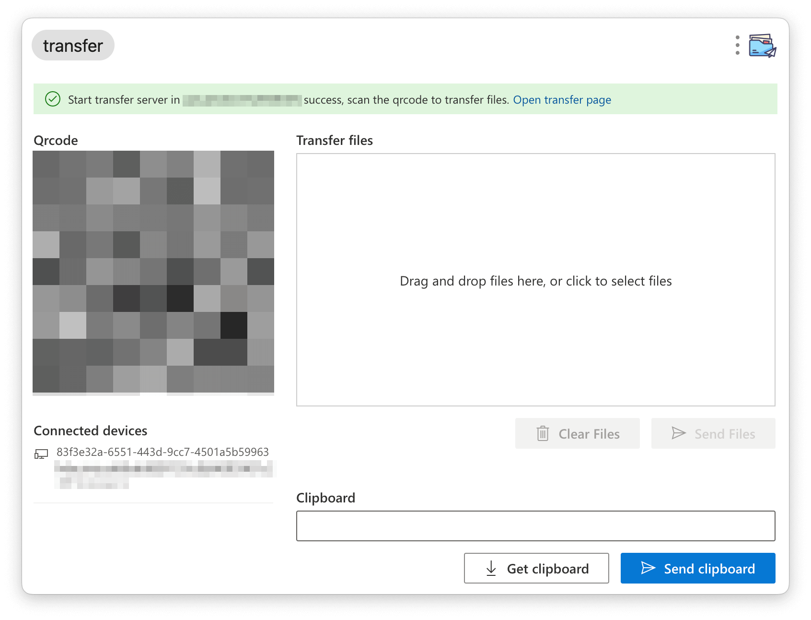
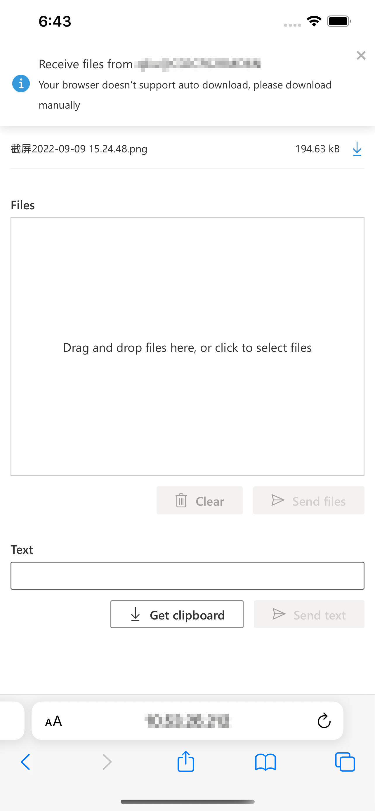

# utools plugin transfer ✈️

  

A [utools](https://u.tools/) plugin for transfer files between LAN devices, based on http protocol.

## Features

- Lightweight and easy-to-use UI
- Support download and upload realtime progress, and notifcations for transfer result
- Support Desktop push
- Support transfer directory (Todo in plan)

## Screenshots

### Desktop

### Mobile

Support for any device with new browsers.

## License

[MIT](./LICENSE)
