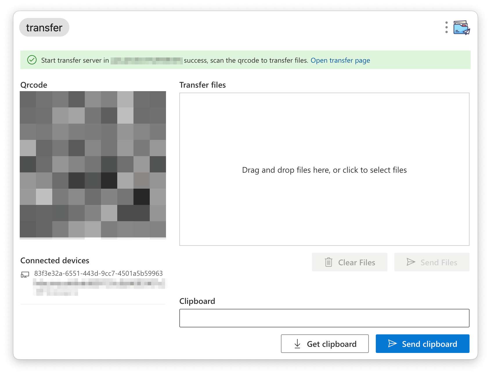

# utools 文件传输 ✈️

  

一个用于在局域网设备之间传输文件的 [utools](https://u.tools/) 插件，基于 http 协议。

## 特性

- 轻量、简单易用的 UI
- 支持实时进度条和传送结果通知
- 支持桌面端主动推送
- 支持传输文件夹（计划中）

## 截图示例

### 桌面端

### 另一端

可以是任意有新版浏览器的设备。

## License

[MIT](./LICENSE)
